# {.tabset .tabset-fade .tabset-pills}

```{r, echo=FALSE}

library(pracma)
library("plotrix")

# make_function <- function(args, body, env = parent.frame()) {
#   args <- as.pairlist(args)

#   eval(call("function", args, body), env)
# }
# stepplot <- function(expr, xmax, n = 1000, 
#                    env = parent.frame()) {
#   f <- make_function(alist(t = ), substitute(  
#   (t < 0) * (0) + (0 <= t) * expr), ## Stepfunktionen ganges på..
#   env)

#   t <- seq(-0.5, xmax, length = n)
#   y <- f(t)
#   plot(t, y, type = "l", xlab = "t [s]", ylab = "f(t)",col = "red",lty=1, main= deparse(substitute(expr)),panel.first = grid())
#   abline(v = 0, h = 0,lty=2)
 
# }
pole_zero_plot <- function(x_zero_, y_zero_, x_pole_, y_pole_, range,expr, exprrange = 5,exprmin = 0.25) {

## Function + inv laplace:
expr_ <- function(s) {expr(s)}
step <- function(s) {(1/s)*expr_(s)}
pulseLi <- invlap(expr, 0, exprrange, 1000)
stepLi <- invlap(step, 0, exprrange, 1000)

  ## Poles:
x_pole = x_pole_
y_pole = y_pole_
  ## Zeroes:
x_zero = x_zero_
y_zero = y_zero_
minMax <- c(-range,range)
  # RUN ME!
  par(lab = c(10, 10, 5),pty="s")
  plot(
      x_pole,
      y_pole,
      pch = 4, cex = 2,
  xlim = c(minMax[1], minMax[2]), ylim = c(minMax[1], minMax[2]), panel.first = grid(),
  xlab = "Real", ylab = "Imaginær")
  if (0 < length(x_zero)) {
    points(x_zero, y_zero, pch = 1, cex = 2) ## ZERO PLOT
    text(x_zero, y_zero, labels = seq(1, length(y_zero)), pos = 1) # Zero text
  }
  ## Konvergens rektankel.
  rect(max(x_pole), minMax[1]-5, minMax[2]+5, minMax[2]+5, density = 8, angle = 45, col = rgb(0, 0, 0, alpha = 0.2))
  rect(max(x_pole), minMax[1]-5, minMax[2]+5, minMax[2]+5, density = 8, angle = -45, col = rgb(0, 0, 0, alpha = 0.2))
  
  # mtext(paste("Konvergens: ", round(max(x_pole),digits=4)), side=1, line=3.5, at=9)

  text(x_pole, y_pole, labels = seq(1, length(y_pole)), pos = 1) # Pole text
  ## Aksepile.
  arrows(minMax[1], 0, minMax[2], 0, lwd = 1, length = 0.15)
  arrows(0, minMax[1] - 5, 0, minMax[2], lwd = 1, length = 0.15)
  draw.circle(0, 0, 1, nv = 1000, border = NULL, col = NA, lty = 4, lwd = 1)

  #End of assignment
par(pty="m")
## Step plot
  plot(stepLi,type="l", col="Red", xlim = c(-exprmin, exprrange), panel.first = grid(),
  xlab = "t [s]", ylab = "f(t)",
  main="Stepresponse",
  axes=FALSE
  )
  axis(1, at = axTicks(1))
axis(2, at = axTicks(2))
  abline(v = 0, h = 0,lty=2)
  abline(v = 0, h = 0,lty=2)
n <- seq(1, 6, 1)
abline(v = n*(-max(x_pole)^{-1}),lty=1,lwd = 3,col = rgb(0, 0, 0, alpha = 0.2)) 

 ## Puls plot 
  plot(pulseLi,type="l", col="Blue", xlim = c(-exprmin, exprrange), panel.first = grid(),
  xlab = "t [s]", ylab = "f(t)",
  main="Impulseresponse",
  axes=FALSE
  )
  axis(1, at = axTicks(1))
axis(2, at = axTicks(2))
  abline(v = 0, h = 0,lty=2)
n <- seq(1, 6, 1)
abline(v = n*(-max(x_pole)^{-1}),lty=1,lwd = 3,col = rgb(0, 0, 0, alpha = 0.2)) 
}
```

## Info

Når der snakkes op-amp konfigurationer, refereres der til de her to:

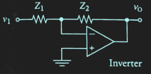

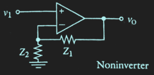

## Noter fra lektion 2020-03-10

```{r child = "chp11/20200310.Rmd"}
```


## Opgave 3

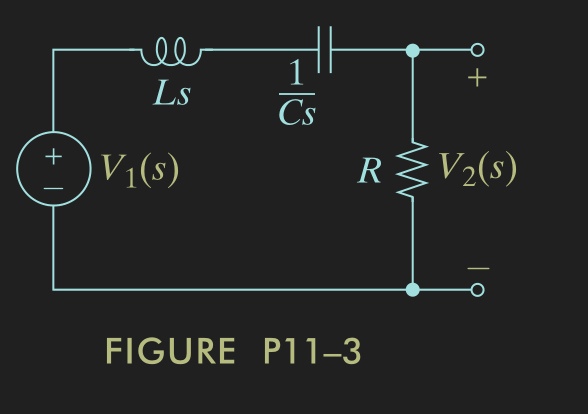
```{r child = "chp11/opg03.Rmd"}
```

## Opgave 5

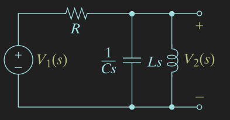
```{r child = "chp11/opg05.Rmd"}
```

## Opgave 7

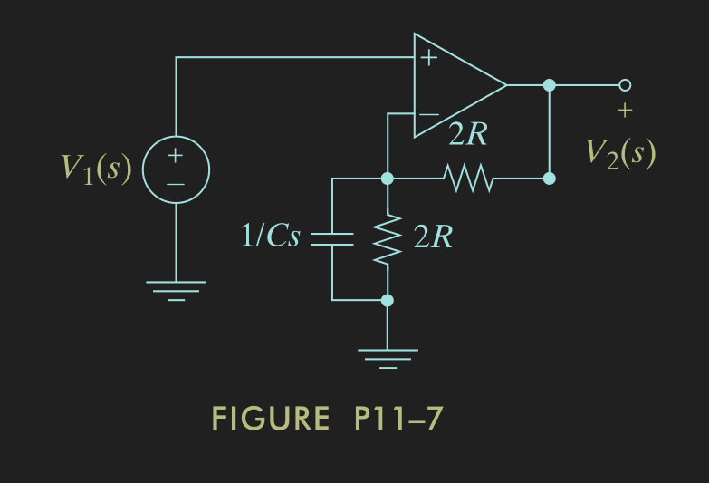
```{r child = "chp11/opg07.Rmd"}
```

## Opgave 9

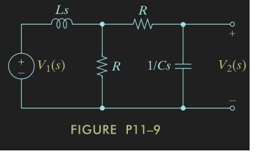
```{r child = "chp11/opg09.Rmd"}
```

## Opgave 11

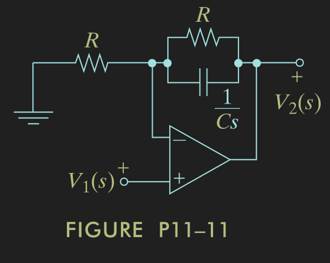
```{r child = "chp11/opg11.Rmd"}
```

## Opgave 13

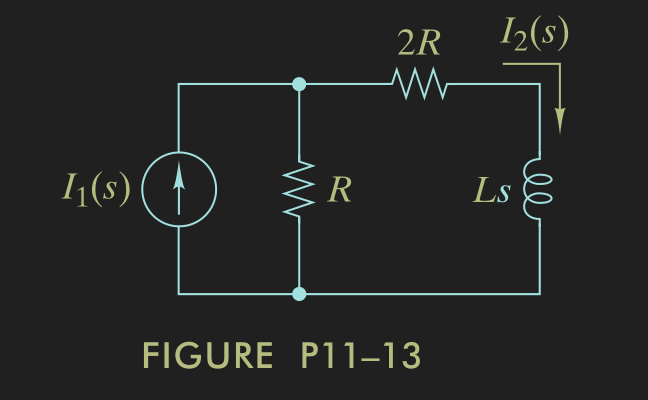
```{r child = "chp11/opg13.Rmd"}
```

## Opgave 15

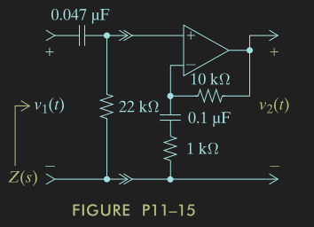
```{r child = "chp11/opg15.Rmd"}
```

## Opgave 17

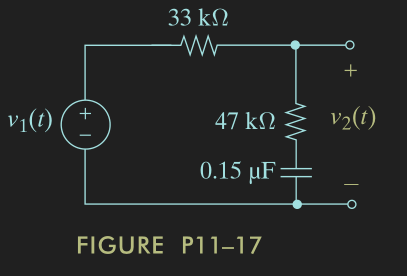
```{r child = "chp11/opg17.Rmd"}
```

## Designopgave 23

```{r child = "chp11/opg23.Rmd"}
```

## Opgave 34

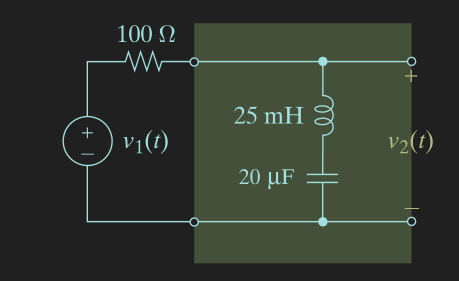
```{r child = "chp11/opg34.Rmd"}
```

## Opgave 35

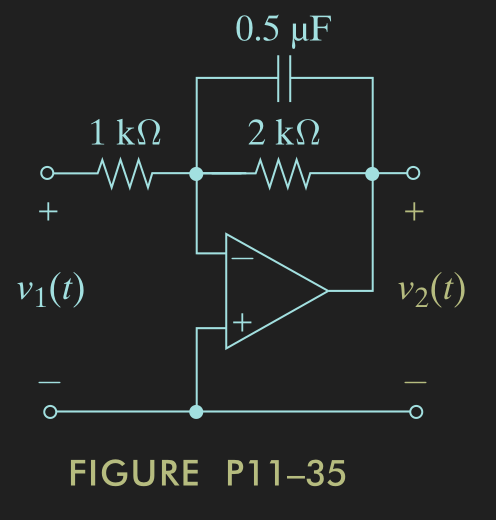
```{r child = "chp11/opg35.Rmd"}
```


## Opgave 37

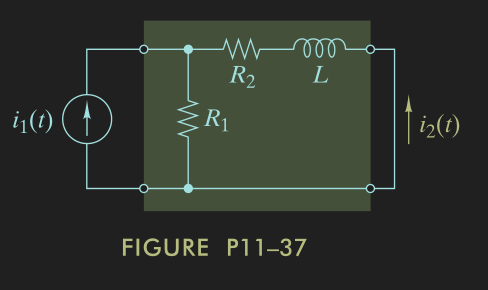
```{r child = "chp11/opg37.Rmd"}
```


## Opgave 70 

```{r child = "chp11/opg70.Rmd"}
```

## Opgave 71 

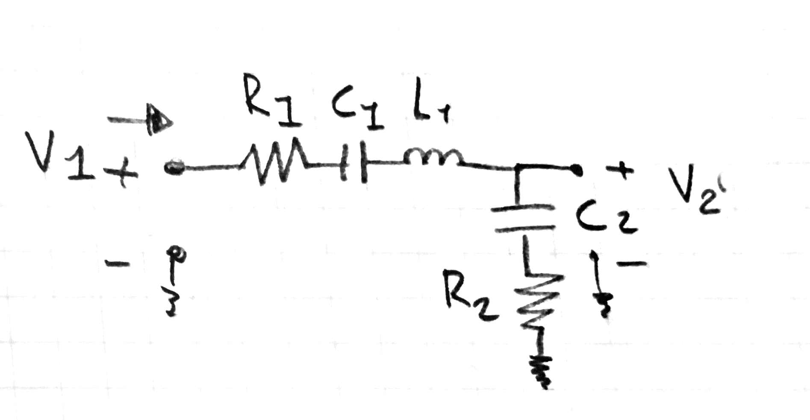


```{r child = "chp11/opg71.Rmd"}
```
